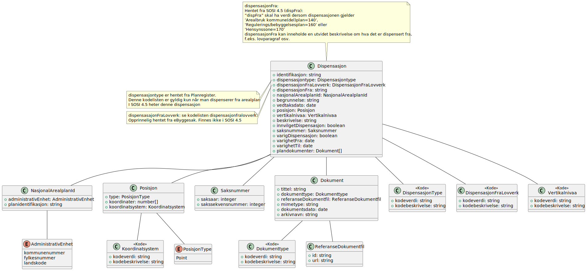

# Finn dispensasjoner resultat

**Skjema**: `no.ks.fiks.plan.v2.innsyn.dispensasjoner.finn.resultat.schema.json`

### Finn dispensasjoner resultat

### Dispensasjon

### NasjonalArealplanId

### Posisjon

### Saksnummer

### Dokument

