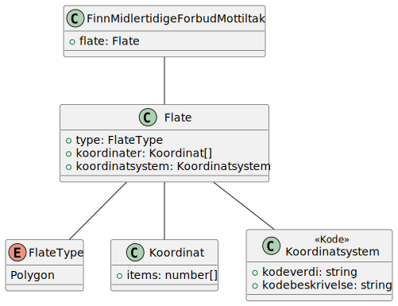
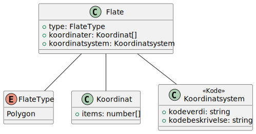

# Finn midlertidigeforbudmottiltak for flate

**Skjema**: `no.ks.fiks.plan.v2.innsyn.midlertidigeforbudmottiltak.finn.for.flate.schema.json`

### Finn midlertidigeforbudmottiltak for flate

### Flate

