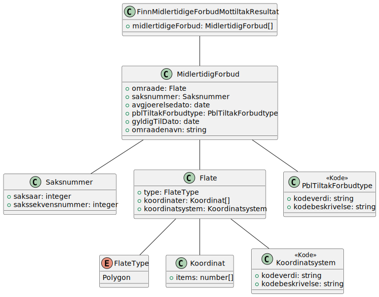
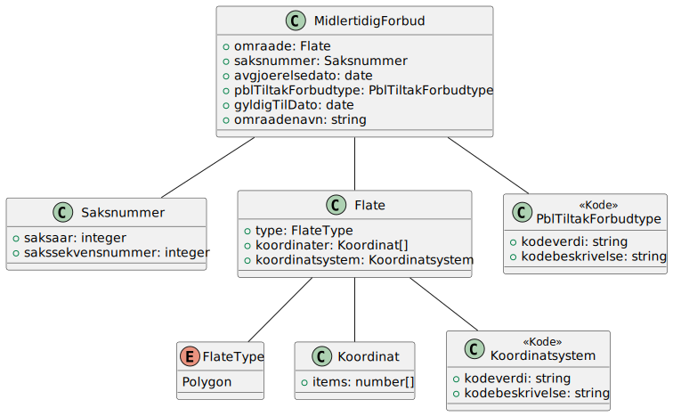
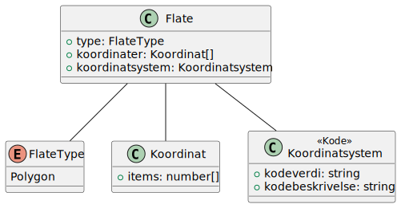

# Finn midlertidigeforbudmottiltak resultat

**Skjema**: `no.ks.fiks.plan.v2.innsyn.midlertidigeforbudmottiltak.finn.resultat.schema.json`

### Finn midlertidigeforbudmottiltak resultat

### Midlertidigforbud

### Flate

### Saksnummer

