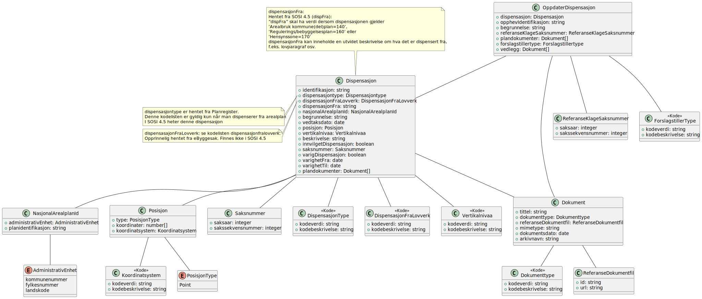
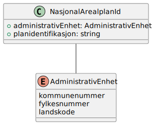

# Oppdater dispensasjon

**Skjema**: `no.ks.fiks.plan.v2.oppdatering.dispensasjon.oppdater.schema.json`

### Oppdater dispensasjon

### Dispensasjon

### Dokument

### NasjonalArealplanId

### Posisjon

### Saksnummer

