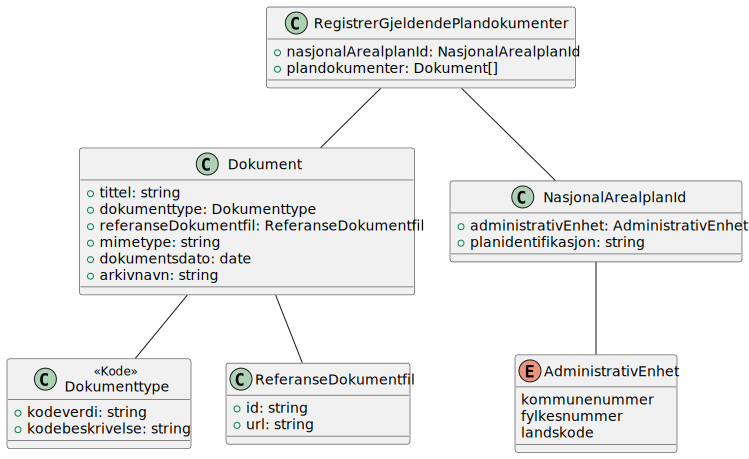

# Registrer gjeldendeplandokumenter - klassediagram

**Skjema**: `no.ks.fiks.plan.v2.oppdatering.gjeldendeplandokumenter.registrer.schema.json`

### Registrer gjeldendeplandokumenter

### NasjonalArealplanId

### Dokument

