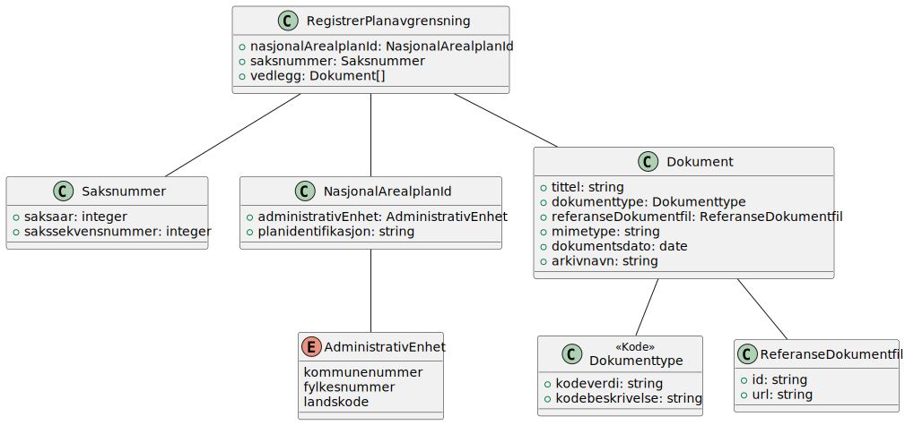

# Registrer planavgrensning

**Skjema**: `no.ks.fiks.plan.v2.oppdatering.planavgrensning.registrer.schema.json`

### Registrer planavgrensning

### NasjonalArealplanId

### Dokument

### Saksnummer

