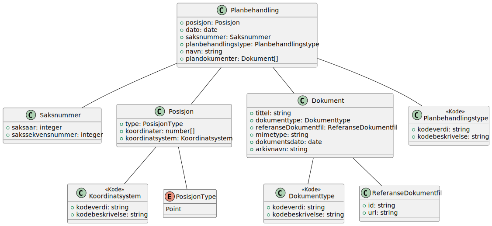

# Registrer planbehandling - klassediagram

**Skjema**: `no.ks.fiks.plan.v2.oppdatering.planbehandling.registrer.schema.json`

### Registrer planbehandling

### NasjonalArealplanId

### Planbehandling

### Posisjon

### Saksnummer

### Dokument

