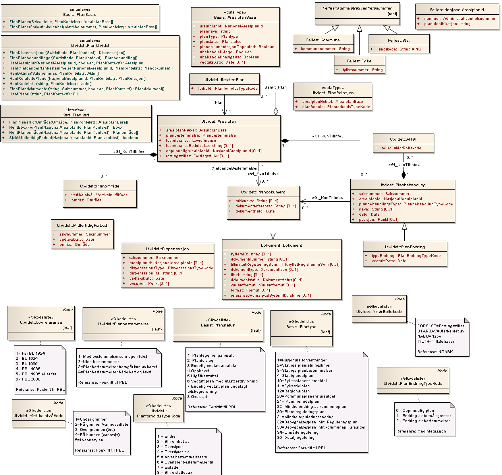
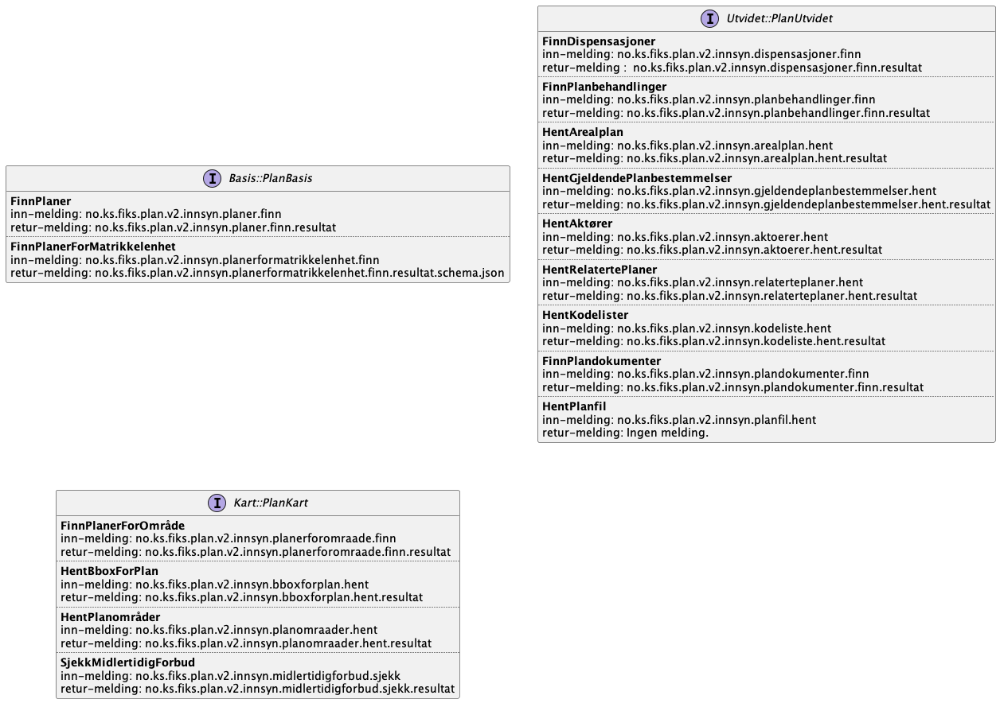

# GI til Fiks-Plan forklaring

Merk at dette er bare ment for å vise hva de nye meldingstypene tilsvarer i tidligere GI tjenesten. 
Meldingene i protokollen har ikke noe som kobler dem opp mot interfacene PlanBasis, PlanUtvidet og PlanKart slik de er beskrevet i GI. 
Dette er ikke begreper som eksisterer som interfacer i Fiks-Plan protokollen. 

## GI service - innsyn
Slik modellen var for GI innsyn. Merk at her ser vi kun på Interfacene PlanBasis, PlanUtvidet og PlanKart og hva Fiks-Plan protokollen erstatter der.

## Nye meldinger i Fiks-Plan

Meldingstypene slik de tilsvarer hvert tjeneste-punkt i interface fra GI tjenesten. 

