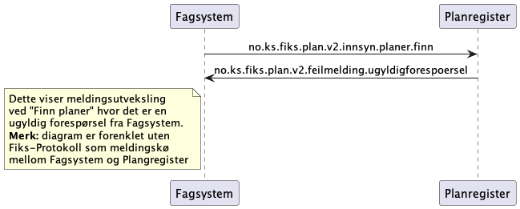
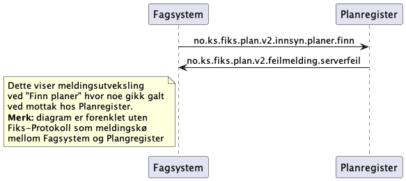

# Finn planer

**Meldinger**: 
- `no.ks.fiks.plan.v2.innsyn.planer.finn`
- `no.ks.fiks.plan.v2.innsyn.planer.resultat`

**Feilmeldinger**:
- `no.ks.fiks.plan.v2.feilmeldinger.ugyldigforespoersel`
- `no.ks.fiks.plan.v2.feilmeldinger.serverfeil` 

### Sekvensdiagram

#### Finne planer med resultat tilbake til fagsystem

#### Ugyldig forespørsel: Finne planer med ugyldig forespørsel feilmelding tilbake til fagsystem

Feilmeldingen ugyldig forespørsel sendes tilbake hvis noe var galt med forespørselen. 
F.eks. ugyldig json i henhold til skjema, eller noe annet ugyldig innhold.

Feilmeldingen skal inneholde en melding tilbake til avsender som forklarer hva som var galt.

#### Serverfeil: Finne planer med serverfeil feilmelding tilbake til fagsystem

Feilmeldingen serverfeil sendes tilbake hvis noe gikk galt hos mottaker og man klarer å kontrollert sende denne feilmeldingen tilbake.

Feilmeldingen bør inneholde en melding tilbake til avsender som forklarer hva som var galt.

### Klassediagram
#### no.ks.fiks.plan.v2.innsyn.planer.finn

#### no.ks.fiks.plan.v2.innsyn.planer.resultat

*kommer*