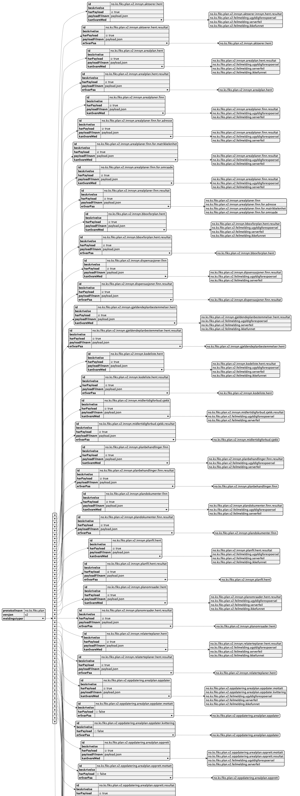

# Dokumentasjon for Fiks Plan V2

*Her kommer mer informasjon om denne versjonen av protokollen...*

## Meldingstyper

Hver meldingstype har et tilhørende skjema, med samme navn, som følger med i denne versjonen av protokollen.

Meldingstypene og hvordan de henger sammen er definert i json-filen [meldingstyper.json](./../../Schema/V2/meldingstyper/meldingstyper.json)

## Kart over meldingstypene

Dette kartet er generert ut i fra `meldingstyper.json` vha PlantUML

