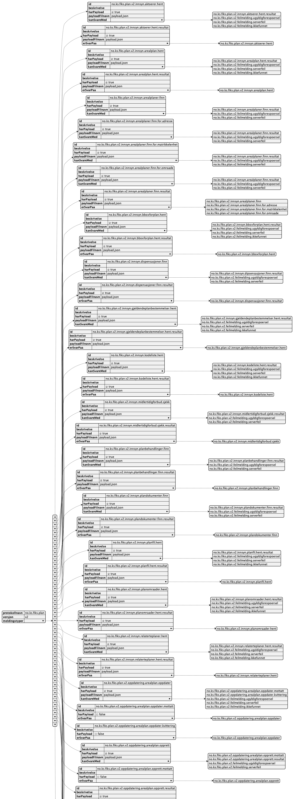

# Dokumentasjon for Fiks Plan V2

*Her kommer mer informasjon om denne versjonen av protokollen...*

## Meldingstyper

Hver meldingstype har et tilhørende skjema, med samme navn, som følger med i denne versjonen av protokollen.

Meldingstypene og hvordan de henger sammen er definert i json-filen [meldingstyper.json](./../../Schema/V2/meldingstyper/meldingstyper.json)

## Kart over meldingstypene

Dette kartet er generert ut i fra `meldingstyper.json` vha PlantUML

### Forklaringer til meldingstyper.json

**id**: Navn på meldingstypen.

**harPayload**: Skal melding inneholde payload.

**payloadFilnavn**: Navnet payload-filen skal ha. Payload er meldingen som skal være i henhold til skjemaet som tilhører denne meldingstypen.

**kanSvareMed**: Meldingstyper denne meldingen kan svare med. Typisk en respons, kvittering, mottatt eller eventuelle feilmeldinger.

**erSvarPaa**: Hvilken melding(er) er denne meldingen et svar på. 

