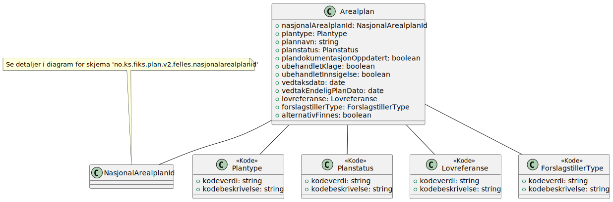
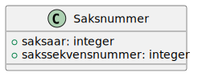

# Hent arealplan resultat

**Skjema**: `no.ks.fiks.plan.v2.innsyn.arealplan.hent.resultat.schema.json`

### Hent arealplan resultat

### Arealplan

### Planbehandling

### NasjonalArealplanId

### Posisjon

### Saksnummer

### Dokument

