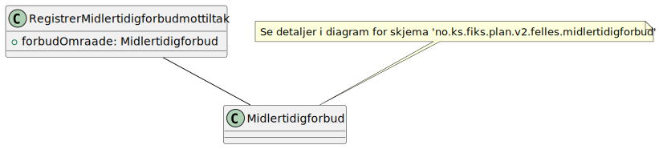
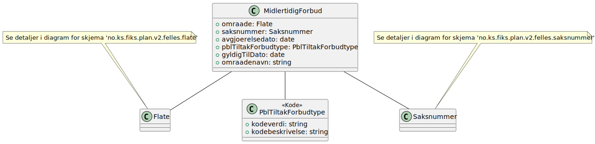

# Registrer midlertidigforbudmottiltak

**Skjema**: `no.ks.fiks.plan.v2.oppdatering.midlertidigforbudmottiltak.registrer.schema.json`

### Registrer midlertidigforbudmottiltak

### Midlertidigforbudmottiltak

### Flate

### Saksnummer

