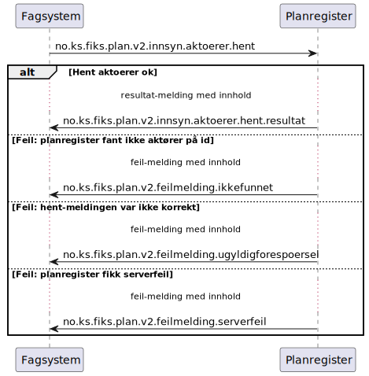

# Hent aktoerer - sekvensdiagram

**Meldinger**:
- `no.ks.fiks.plan.v2.innsyn.aktoerer.hent`
- `no.ks.fiks.plan.v2.innsyn.aktoerer.hent.resultat`

**Feilmeldinger**:
- `no.ks.fiks.plan.v2.feilmeldinger.ugyldigforespoersel`
- `no.ks.fiks.plan.v2.feilmeldinger.serverfeil`
- `no.ks.fiks.plan.v2.feilmeldinger.ikkefunnet`

### Sekvensdiagram

### Klassediagram

[no.ks.fiks.plan.v2.innsyn.aktoerer.hent](./../../ClassDiagrams/no.ks.fiks.plan.v2.innsyn.aktoerer.hent/README.md)
