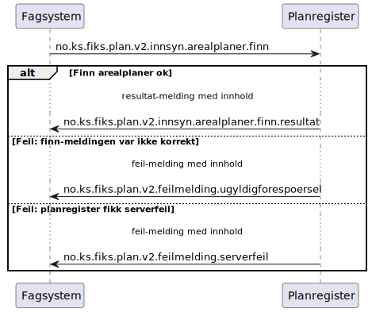

# Finn arealplaner - sekvensdiagram

**Meldinger**:
- `no.ks.fiks.plan.v2.innsyn.arealplaner.finn`
- `no.ks.fiks.plan.v2.innsyn.arealplaner.finn.resultat`

**Feilmeldinger**:
- `no.ks.fiks.plan.v2.feilmeldinger.ugyldigforespoersel`
- `no.ks.fiks.plan.v2.feilmeldinger.serverfeil`

### Sekvensdiagram

### Klassediagram

[no.ks.fiks.plan.v2.innsyn.arealplaner.finn](./../../ClassDiagrams/no.ks.fiks.plan.v2.innsyn.arealplaner.finn/README.md)
