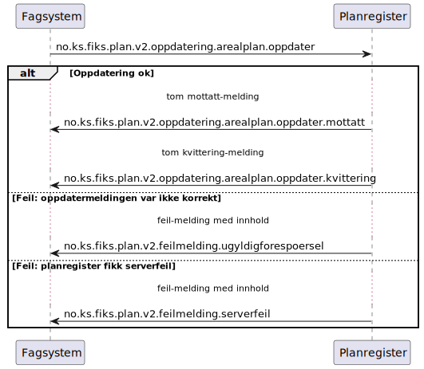

# Oppdater arealplan - sekvensdiagram

**Meldinger**:
- `no.ks.fiks.plan.v2.oppdatering.arealplan.oppdater`
- `no.ks.fiks.plan.v2.oppdatering.arealplan.oppdater.mottatt`
- `no.ks.fiks.plan.v2.oppdatering.arealplan.oppdater.kvittering`

**Feilmeldinger**:
- `no.ks.fiks.plan.v2.feilmeldinger.ugyldigforespoersel`
- `no.ks.fiks.plan.v2.feilmeldinger.serverfeil`

### Sekvensdiagram

### Klassediagram

[no.ks.fiks.plan.v2.oppdatering.arealplan.oppdater](./../../ClassDiagrams/no.ks.fiks.plan.v2.oppdatering.arealplan.oppdater/README.md)
