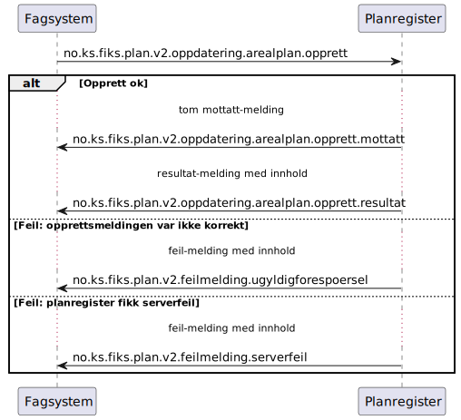

# Opprett arealplan - sekvensdiagram

**Meldinger**:
- `no.ks.fiks.plan.v2.oppdatering.arealplan.opprett`
- `no.ks.fiks.plan.v2.oppdatering.arealplan.opprett.mottatt`
- `no.ks.fiks.plan.v2.oppdatering.arealplan.opprett.kvittering`

**Feilmeldinger**:
- `no.ks.fiks.plan.v2.feilmeldinger.ugyldigforespoersel`
- `no.ks.fiks.plan.v2.feilmeldinger.serverfeil`

### Sekvensdiagram

### Klassediagram

[no.ks.fiks.plan.v2.oppdatering.arealplan.opprett](./../../ClassDiagrams/no.ks.fiks.plan.v2.oppdatering.arealplan.opprett/README.md)
