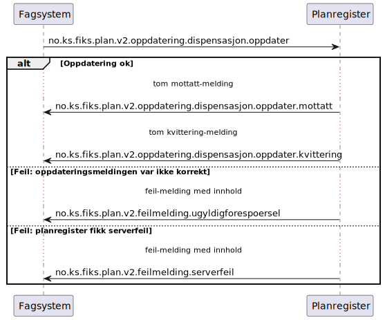

# Oppdater dispensasjon - sekvensdiagram

**Meldinger**:
- `no.ks.fiks.plan.v2.oppdatering.dispensasjon.oppdater`
- `no.ks.fiks.plan.v2.oppdatering.dispensasjon.oppdater.mottatt`
- `no.ks.fiks.plan.v2.oppdatering.dispensasjon.oppdater.kvittering`

**Feilmeldinger**:
- `no.ks.fiks.plan.v2.feilmeldinger.ugyldigforespoersel`
- `no.ks.fiks.plan.v2.feilmeldinger.serverfeil`

### Sekvensdiagram

### Klassediagram

[no.ks.fiks.plan.v2.oppdatering.dispensasjon.oppdater](./../../ClassDiagrams/no.ks.fiks.plan.v2.oppdatering.dispensasjon.oppdater/README.md)
