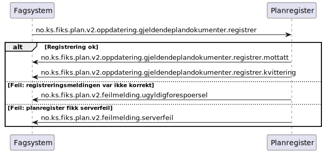

# Registrer gjeldende plandokumenter - sekvensdiagram

**Meldinger**:
- `no.ks.fiks.plan.v2.oppdatering.gjeldendeplandokumenter.registrer`
- `no.ks.fiks.plan.v2.oppdatering.gjeldendeplandokumenter.registrer.mottatt`
- `no.ks.fiks.plan.v2.oppdatering.gjeldendeplandokumenter.registrer.kvittering`

**Feilmeldinger**:
- `no.ks.fiks.plan.v2.feilmeldinger.ugyldigforespoersel`
- `no.ks.fiks.plan.v2.feilmeldinger.serverfeil`

### Sekvensdiagram

### Klassediagram

[no.ks.fiks.plan.v2.oppdatering.gjeldendeplandokumenter.registrer](./../../ClassDiagrams/no.ks.fiks.plan.v2.oppdatering.gjeldendeplandokumenter.registrer/README.md)
