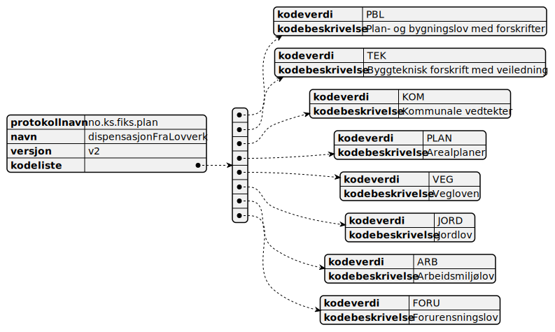

# Kodeliste for "dispensasjon fra lovverk"

Kode som angir om det er dispensasjon fra f.eks. lov eller plan

Json-filen `no.ks.fiks.plan.v2.kodelister.dispensasjonfralovverk.json` med definisjonen finnes i samme mappen [her](no.ks.fiks.plan.v2.kodelister.dispensasjonfralovverk.json)

Generert oversikt fra json-filen:
